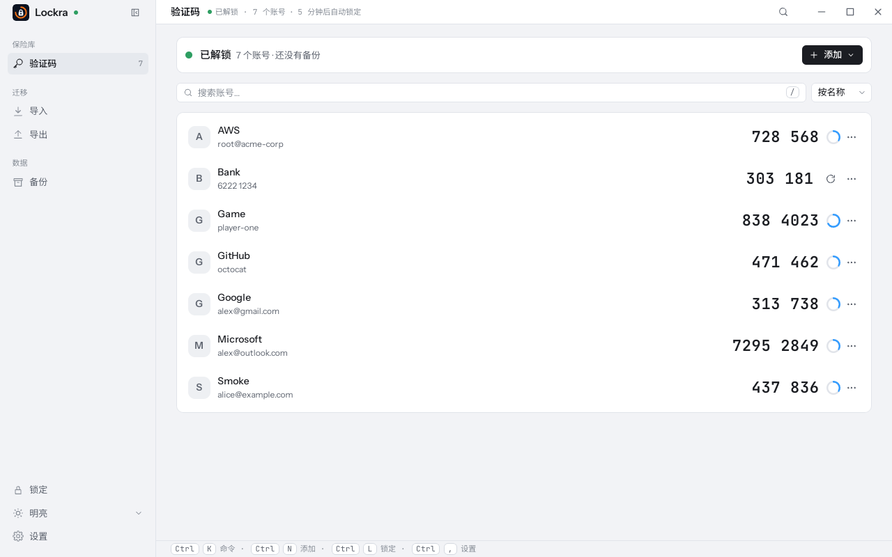

<div align="center">


# Lockra

### 两步验证码保存在自己的电脑上，加密，离线。

[](https://github.com/sunerpy/lockra/actions/workflows/ci.yml)
[](https://github.com/sunerpy/lockra/releases)
[](../../LICENSE)

[特性](#特性) · [安装](#安装) · [快速开始](#快速开始) · [文档](https://firlab.app/lockra/zh/) · [开发](#开发)

[English](../../README.md) · [**简体中文**](./README.zh-CN.md)

</div>

---

Lockra 是一个 TOTP/HOTP 验证器，支持 Windows、macOS 和 Linux。账号保存在本机的一个加密文件中，Lockra
本身不联网。它可以从 Google 身份验证器和 Microsoft Authenticator 导入账号，也可以导出给它们，并把加密
备份写入你选择的文件夹。



## 特性

- **验证码**：TOTP（SHA1、SHA256、SHA512，6–8 位，任意周期）和 HOTP。点击一行即复制；30 秒后，如果剪贴板中
  仍是这个验证码就会清空；验证码在最后 5 秒同时显示下一个。支持搜索、分组、收藏和隐藏验证码。
- **导入**：Google 身份验证器「转移账号」生成的二维码（照片或截图，可一次选多张）、已 root 的 Android 手机上
  Microsoft Authenticator 的数据库、`otpauth://` 链接与列表，以及 Lockra 备份。保存之前先给出预览，逐条标明
  新增、已存在、同名不同密钥或不支持，并说明原因。
- **导出**：给 Google 身份验证器的迁移二维码、给 Microsoft Authenticator 的每个账号一张标准二维码，或者明文列表。
  每种方式都要再次输入主密码，二维码旁边显示当前验证码，方便与手机核对。
- **备份**：随时手动备份为加密的 `.lockrabackup` 文件；也可以在每次修改几秒后自动备份到指定文件夹（OneDrive、
  Google Drive 或 iCloud 的同步文件夹均可），只保留最近几份。恢复时可以合并，也可以整体替换。
- **安全**：Argon2id 与 XChaCha20-Poly1305，可选用系统钥匙串解锁，自动锁定，显示密钥时阻止截屏（Windows 和
  macOS）。
- **界面**：四套主题、八种强调色，中英文界面，命令面板（`Ctrl K`），全程可用键盘操作。

## 安装

1. **下载安装包**：在[发布页](https://github.com/sunerpy/lockra/releases)选择 Windows 安装程序（x64 与 ARM64）、
   适用于 Apple 芯片或 Intel Mac 的 dmg，或适用于 Linux（x64 与 ARM64）的 deb、rpm、AppImage。每个版本都附带
   `SHA256SUMS` 和构建证明：

   ```bash
   sha256sum -c SHA256SUMS --ignore-missing
   gh attestation verify Lockra_0.1.0_amd64.deb --repo sunerpy/lockra
   ```

   安装包目前尚未签名，首次启动时 Windows SmartScreen 和 macOS Gatekeeper 会提示确认
   （[平台说明](https://firlab.app/lockra/zh/reference/platforms)）。

2. **从源码构建**（见[开发](#开发)）。

## 快速开始

1. 启动 Lockra，设置主密码。主密码无法找回，请妥善保管。
2. 在「导入」页导入账号：Google 身份验证器导出二维码的照片、粘贴或从剪贴板读取的链接，或者一个备份。
3. 点击账号即可复制验证码。在「备份」页开启自动备份。

[文档](https://firlab.app/lockra/zh/)详细介绍了每一步、在手机与电脑之间迁移账号、备份、安全和常见问题。

## 开发

需要 Rust 1.98（见 `rust-toolchain.toml`）、Node ≥ 20.19 和 pnpm 9；Linux 上还需要 webkit2gtk 4.1。
`make check` 另外需要 Python ≥ 3.9、cargo-llvm-cov、cargo-deny、actionlint 和 shellcheck，缺少其中
任何一个时，会在开始检查前列出。

```bash
pnpm install --frozen-lockfile
pnpm --filter @lockra/desktop tauri dev   # 带热重载的桌面应用
pnpm dev                                  # 只运行界面，后端是内存中的模拟核心
make check                                # 全部检查
make help                                 # 其余命令
```

开发流程见 [CONTRIBUTING.md](../../CONTRIBUTING.md)，代码约定见 [AGENTS.md](../../AGENTS.md)，代码结构见
[docs/architecture.md](../architecture.md)，文件格式见 [docs/formats.md](../formats.md)，安全模型见
[docs/security.md](../security.md)，发布流程见 [docs/release.md](../release.md)。

## 许可证

[Apache-2.0](../../LICENSE)。界面设计源自 [Voltip](https://github.com/sunerpy/voltip)；随附字体采用 SIL Open Font
License 1.1（[NOTICE](../../NOTICE)）。
